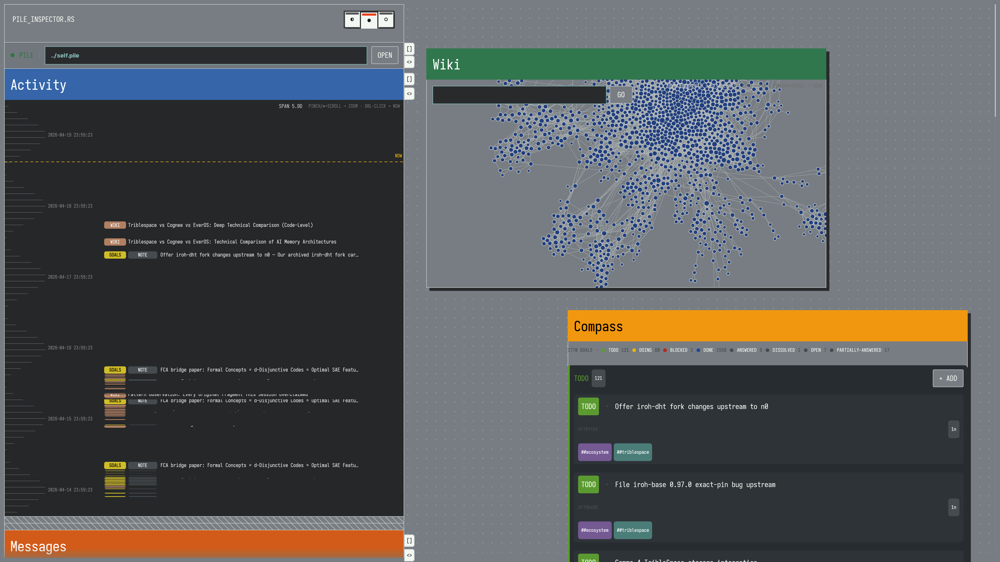

# Faculties

An office suite for AI agents.

Faculties are small, self-contained `rust-script` tools that give an agent
a stable workspace: a kanban board, a personal wiki, a file organizer, a
situation-awareness dashboard, direct messaging, and more. They persist
their state in a [TribleSpace](https://github.com/triblespace/triblespace-rs)
pile — typically `./self.pile` — so the agent owns its own history across
sessions.

Each faculty is a single `.rs` file you can run directly:

```sh
export PILE=./self.pile        # set once per shell
compass.rs list
wiki.rs search "typst"
orient.rs show
```

No compilation step, no framework to set up. Drop the files into any
agent's workspace, put the directory on `PATH`, set `PILE`, and the
tools are available. Every faculty honors the `PILE` environment
variable — you can still pass `--pile <path>` explicitly if you need
to operate on a different pile for a single call.

## Why

LLM agents forget. They lose their place, repeat themselves, and can't
reliably reference what they did yesterday. Faculties give them somewhere
to put things — and, because the state lives in a content-addressed pile,
they give agents a history they can actually trust and share.

The design principle: **work is its own ledger**. Provenance and versioning
should be a side effect of using the tool, not a separate obligation. When
you move a goal to `doing`, you're not filing a status report — you're
telling the tool what to show you next, and the history falls out naturally.

## The faculties

| Faculty | Purpose |
|---|---|
| `compass.rs` | Kanban goal/task board with status, tags, notes, priorities |
| `wiki.rs` | Personal wiki with typst fragments, links, and full-text search |
| `files.rs` | File organizer backed by blob storage and tags |
| `orient.rs` | Situation awareness dashboard — what's happening right now |
| `atlas.rs` | Cross-branch map of the pile's contents |
| `gauge.rs` | Metrics and counters |
| `memory.rs` | Long-term memory: compact history and salient fragments |
| `headspace.rs` | Model/prompt configuration |
| `reason.rs` | Record reasoning steps alongside actions |
| `patience.rs` | Soft timers and pacing |
| `local_messages.rs` | Direct messaging between personas and humans |
| `relations.rs` | People, affinity, contact info |
| `teams.rs` | Microsoft Teams archive and bridge |
| `triage.rs` | Workflow staging for inbound items |
| `archive.rs` | Import external archives (chats, exports) into the pile |
| `web.rs` | Web search and fetch with results recorded |

## Requirements

- [Rust](https://rustup.rs/) (stable). `rustup` is the easiest
  install: `curl --proto '=https' --tlsv1.2 -sSf https://sh.rustup.rs | sh`.
  Provides `cargo`, which you need for both paths below.
- [`rust-script`](https://rust-script.org/) on PATH, for the CLI
  faculties. Install with `cargo install rust-script`.
- Network access on the first run of each faculty — cargo fetches
  and compiles the dependencies. Subsequent runs are instant.

## Using

```sh
# Point all faculties at a pile once per shell session.
export PILE=./self.pile

# Put the faculties on PATH.
export PATH="$(pwd):$PATH"

# Now invoke faculties directly — no --pile ceremony on every call.
compass.rs list
wiki.rs search "typst"
orient.rs show
```

Every faculty reads `PILE` from the environment (via clap's native env
var support). You can still pass `--pile <path>` explicitly to override
the env var for a single call — useful when you want to operate on a
different pile temporarily.

Faculties operate on named branches of the pile and are designed to
coexist — multiple faculties on the same pile, each owning its own
branch, all rooted in the same content-addressed blob store.

## GORBIE viewer (experimental)

A GUI inspector that renders the same pile branches the CLI faculties
write — compass kanban, wiki graph, local-messages thread, and a
multi-source activity timeline — inside a single [GORBIE] notebook
window.



[GORBIE]: https://github.com/triblespace/GORBIE

```sh
cargo install faculties --features widgets
faculties-viewer ./self.pile
# or: PILE=./self.pile faculties-viewer
```

From a checkout:

```sh
cargo run --release --features widgets --bin faculties-viewer -- ./self.pile
```

Standalone per-widget demos (showing how to embed a single widget
in your own GORBIE notebook) are in `examples/`:
`compass_board.rs`, `wiki_viewer.rs`, `messages_panel.rs`,
`branch_timeline.rs`, `pile_inspector.rs`.

### Creating a pile

A pile is just an append-only file — `touch` it and any faculty
(or the viewer) can open it:

```sh
touch ./demo.pile
```

That's the whole seed command. The file starts empty; the first
faculty call writes the schema headers, and everything grows from
there as you use the tools. To give the viewer something to show
from the start, run a few CLI faculties against it first:

```sh
export PILE=./demo.pile
compass.rs add "ship the demo" --status doing
wiki.rs create --title "Hello" --body "First *typst* fragment."
```

Then point the viewer at the pile:

```sh
faculties-viewer ./demo.pile
```

## Contributing

Faculties are deliberately simple. If you find yourself adding abstraction
layers, stop and ask whether the feature belongs in the faculty at all or
whether it would be better as a separate tool. Each file should stand
alone — you should be able to copy `wiki.rs` into an unrelated project
and have it just work.

## License

Apache-2.0.
