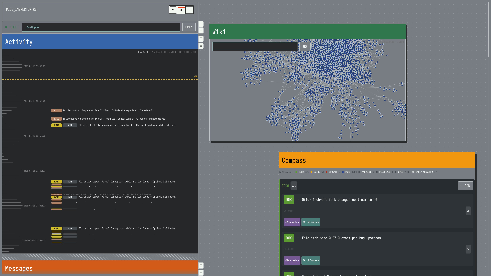

# Faculties

An office suite for AI agents.

Faculties are shared Rust capabilities with CLI and MCP frontends that give
an agent a stable workspace: a kanban board, a personal wiki, a file organizer,
situation awareness, direct messaging, and more. They persist their state in a [TribleSpace](https://github.com/triblespace/triblespace-rs)
pile — typically `./self.pile` — so the agent owns its own history
across sessions.



## Getting started

### Precompiled binaries (sandboxes, restricted envs)

Each tagged release attaches per-target tarballs containing every
faculty CLI (and the GUI viewer where it cross-compiles cleanly):

```sh
# pick the asset matching your platform — see github.com/erlkonig-ai/faculties/releases
curl -L https://github.com/erlkonig-ai/faculties/releases/latest/download/faculties-<TAG>-aarch64-apple-darwin.tar.gz \
  | tar -xz
export PATH="$PWD/faculties-<TAG>-aarch64-apple-darwin:$PATH"
```

### From source (dev environments)

Install a Rust toolchain (if you don't have one):

```sh
curl --proto '=https' --tlsv1.2 -sSf https://sh.rustup.rs | sh
```

Faculties is developed with TribleSpace, Mary, Soma, GORBIE, and two pinned CubeCL
checkouts as one source cohort. These revisions include the target-first collection
API, resident audio decoding, and PNG capture. Clone the siblings, then install every faculty CLI
(and the GUI viewer) onto `$PATH`:

```sh
mkdir faculties-source && cd faculties-source
git clone https://github.com/erlkonig-ai/faculties
git clone https://github.com/triblespace/triblespace-rs
git clone https://github.com/erlkonig-ai/mary
git clone https://github.com/erlkonig-ai/soma
git clone https://github.com/erlkonig-ai/GORBIE
git clone https://github.com/erlkonig-ai/cubecl cubecl-fork
git clone --no-checkout https://github.com/erlkonig-ai/cubecl cubecl-graph
# Keep historical tracked compiler output out of the graph source checkout.
git -C cubecl-graph sparse-checkout set --no-cone '/*' '!**/target/' '!**/target-*/'
git -C triblespace-rs checkout d4164a9ddab775e0749259fac4fff2e93ee29052
git -C mary checkout c08c7fa1ca76f83180125de326b2c7dd70e0a18b
git -C GORBIE checkout 09a82ff3a729093ea6941bd677f589b0e123c0cb
git -C soma checkout 6cdb487c93b10bb183d62f9d547dc1627782c228
git -C cubecl-fork checkout 0c0972c1eb1da5e2d17cc6cc61b3f5e698e73793
git -C cubecl-graph checkout 1fc64da1fba7f9609d19a569000bdd6a6eaea2cd
cd faculties
RUSTFLAGS='-Ctarget-cpu=native' cargo build --release --workspace --bins --locked
scripts/install-release-cohort target/release
cargo install --path ../triblespace-rs/trible --locked
```

That recipe targets the local CPU; use target-appropriate flags for portable
or cross-compiled artifacts. Note that Cargo picks exactly ONE rustflags
source: a `RUSTFLAGS` environment variable REPLACES whatever
`.cargo/config.toml` sets rather than merging with it, so a flag added to the
environment for an unrelated reason silently drops the config's flags.

The cohort installer publishes one content-verified, versioned generation
through `~/.local/bin`. Each generation path is write-once by the installer,
not protected by filesystem immutability or permission changes. Put that
directory before `~/.cargo/bin` on `PATH`. Do not also
run `cargo install --path . --bins`: that creates a second unmanaged Faculties
suite in `~/.cargo/bin`, where an older parser can shadow the active cohort and
misread newer pile records. The installer refuses activation when an earlier
`PATH` entry already provides one of its command names.

### Use it

Create an empty pile and add a few things:

```sh
trible pile create ./self.pile
trible pile signing-key init ./self.pile
export PILE=./self.pile

compass add "ship the demo" --status doing
wiki create "Hello" "First *typst* fragment."
viewer               # picks up PILE from the environment
```

### Library-first faculties, explicit frontends

All 33 ordinary faculties have callable Rust operations, separate CLI and MCP
adapters, and thin individual binaries. Viewer and the 11 capture binaries share
one notebook-composition/capture API. The single `faculties` binary registers
all adapters together: 218 tools, including `viewer_capture`. See the
[complete inventory](#the-faculties) below.

Shared operations own domain logic, resident inputs, observations and write
receipts; a Rust caller does not construct argv, an MCP request, or parse stdout
to use them. Each frontend owns its UX. Atlas and Files use the optional CLI
declaration helper; the other ordinary CLIs retain tailored parsers and use
`cli::with_output` where appropriate. MCP schemas are independent of those
parsers. Cargo shares compilation within a build configuration, while binaries
still link separately.

```sh
atlas --pile ./self.pile list
files --pile ./self.pile view <file-id> --accept image/png --max-dimension 1024
faculties mcp --pile ./self.pile
```

#### MCP server and launcher configuration

`faculties mcp` implements MCP 2025-06-18 over stdio by default, or native
Streamable HTTP with `--http-listen`. Both transports use the same 34 adapters,
229 tools, argument decoding, and native image/audio/resource output. The
library's `mcp::catalog::{Config, Catalog}` constructs the aggregate independently
of either transport, without opening storage, keys, devices, or models.
This server is trusted software, not a filesystem, network, or model-runtime
sandbox. HTTP provides an authenticated internal hop; public TLS/OAuth and
per-user provisioning remain the hosting edge's responsibility.

The launcher owns `--pile`/`PILE` and optional `--key`/`TRIBLESPACE_KEY`;
tools cannot substitute those paths. Additional launcher configuration is:

| Capability | Launcher configuration |
| --- | --- |
| Discord bot access | Optional `--discord-token` / `DISCORD_TOKEN` |
| LinkedIn DMA pulls | Optional `--linkedin-token` / `LINKEDIN_TOKEN` |
| Files semantic search and index maintenance | With `local-embed` (enabled by default), Nomic text and vision roots live in the working pile's `mary-model-graph` collection. No separate model-path setting; index maintenance requires GB10, while other machines read the replicated index |
| Existing Duplex session | Optional `--duplex-session` / `DUPLEX_SESSION` directory |
| Finite Hear inference | `--hear-model-pile`, `--hear-config-json`, and `--hear-tokenizer-json` together; corresponding `HEAR_MODEL_PILE`, `HEAR_CONFIG_JSON`, `HEAR_TOKENIZER_JSON` variables, plus optional `--hear-model` / `HEAR_MODEL` |

Prefer the token environment variables to visible argv; help hides their
values. Discovery needs neither tokens nor model assets. Resident Discord and
LinkedIn operations work without their network tokens. Teams and Mail use
configured pile-backed auth/account state and exact encrypted Secrets-version
references, not raw credential or host-file arguments on their MCP adapters.
Voice/Imagine model sources are also launcher configuration, described below.

On Unix both executable transports detach ordinary stdin to EOF and ordinary
stdout to diagnostic stderr before starting handlers or threads. Stdio alone
reserves private close-on-exec protocol descriptors first.
Standard-stream aliases cannot consume/corrupt JSON-RPC, and child processes do
not inherit its private descriptors. There is no generic CLI subprocess wrapper.
Explicit native tools can still make network requests, send messages, decrypt
secrets, or evaluate stored Habit predicates; their descriptions name those
effects.

Adapters emit ordered text, perceptual images/audio, and explicit binary
resources through `Out`. MCP packages them in one bounded response, retaining
accepted partial output and marking handler failures. Defaults are 1 MiB per
request and 8 MiB per response, including encoded content. Native calls are
sequential; HTTP can receive concurrent requests through bounded admission, but
does not run faculty handlers concurrently or forcibly cancel native calls.
A failure does not undo a completed publication or external send, and the server
does not automatically retry it.
Ordinary handler unwinds also become tool errors, retaining already accepted
output. This is not backend-state repair or recovery from aborts, GPU failures,
or out-of-memory termination.

The aggregate catalogue owns one lazily opened store for its configured pile.
All pile-backed adapters share its indexes, I/O runtime and lazy-fetch leech;
tool calls and HTTP protocol sessions do not reopen the pile or restart that
leech. Each operation still takes fresh snapshots, including newly appended
records from other processes. Collection views are never cached in this owner.
Discovery remains I/O-free, and resident reads do not start the network host.

Native applications can opt into the same lifetime with
`storage::Storage::shared(pile, key)` and the faculties' `with_storage`
constructors. Independent owners never share implicitly by pathname. Existing
`new(pile, key)` constructors retain operation-scoped CLI storage. Compound
operations can use `Storage::scope` to retain a store while releasing its
borrow across external work. The aggregate executable explicitly closes storage
after transport shutdown; embedders should call `Catalog::finish(result)` or
`close()` to report persistence errors. Shared appends are visible immediately
but are not implicitly flushed at the end of each tool call.

#### Streamable HTTP and existing hosting infrastructure

Provision an independent random bearer token (32..=1024 bearer-token characters)
in a launcher-readable, access-restricted file, then select HTTP explicitly:

```sh
faculties mcp --pile /srv/faculties/self.pile --key /srv/faculties/self.key \
  --http-listen 127.0.0.1:8378 \
  --http-token-file /srv/faculties/http.token \
  --http-origin https://mcp.example.com
```

`FACULTIES_MCP_TOKEN_FILE` can supply the token-file path. The token itself is
not a CLI argument or tool input. It is read once at startup; rotating it means
restarting that worker. A final LF/CRLF is allowed. HTTP-only flags require
HTTP mode; they cannot silently start a stdio server instead.

The endpoint is `/`, not `/mcp`. POST accepts one JSON-RPC message and returns
JSON, or empty 202 for an accepted notification. Initialize returns an opaque
`Mcp-Session-Id`; subsequent requests use that header and the negotiated
`MCP-Protocol-Version`. DELETE closes the session. GET returns 405 because
there is no standalone SSE stream. POST clients must accept both
`application/json` and `text/event-stream`, as required by
[Streamable HTTP](https://modelcontextprotocol.io/specification/2025-06-18/basic/transports).
The transport validates every present Origin against the exact repeatable
allowlist; absent Origin is supported for server-to-server clients. No wildcard
origins or browser CORS access are installed.

Defaults are 64 sessions, 30-minute session idle expiry, 16 admitted requests
(body reads + queued/running calls + retained response bodies), and a 30-second
body-read timeout. Work is executed outside the HTTP I/O runtime, preserving
blocking native APIs and
adapters that are not Send/Sync. Saturation is rejected before dispatch; a
disconnect after admission does not cancel or retry a call. Shutdown drains
admitted work, so an uninterruptible native call or slow response consumer can
delay shutdown. These are transport bounds, not limits on model allocations,
external calls, or all
HTTP/socket buffering.

For an existing Playground deployment, reuse Caddy/TLS and the current OAuth
authority. The authenticated edge should select a worker with the colleague's
existing fixed pile/key/filesystem context and replace the public credential
with that worker's internal bearer token. Never choose the worker from an
untrusted tenant header, forward public OAuth tokens as internal credentials,
or switch process-wide collection/key variables between users. Loopback alone
is not sufficient when child jails share the parent's network stack. Preserve
the current OAuth resource identity and keep shared-pile access explicitly
separate from the personal pile. The HTTP implementation does not itself deploy
this routing, provision coworkers, add public download URLs, or change an
existing public service; that integration is a distinct hosting step.

#### Literal values and transport-specific UX

MCP prose and names are literal: `@-`, `@path`, and `@@text` do not read
host input. CLI free-text arguments that support the shared resolver expand
`@path` and `@-`, with `@@text` escaping a leading at-sign. Numeric MCP
options use JSON numbers. Typed decoders reject duplicate/unknown fields;
nested record fields require JSON objects, not positional arrays.

Attribution is explicit in MCP: for example, Message requires `from`, Mail
read tracking requires `persona`, and Compass writes accept optional
`persona`. No adapter silently takes `PERSONA`, `TURN_ID`, or `WORKER_ID`
from the host to attribute an action. These fields are cooperative attribution,
not authentication: publication still uses the configured signer and collection
authority.

| Operation | CLI | MCP |
| --- | --- | --- |
| Perceive | `files view ID --accept image/png` | `files_view {"id":"ID","accept":["image/png"]}` |
| Export original | `files get ID path` or `files get ID @-` | `files_get {"id":"ID"}` |
| Import bytes | `files add path` | `files_add {"name":"notes.txt","mime":"text/plain","data":"base64…"}` |
| Resolve a batch | `files resolve @path` or `files resolve @-` | `files_resolve {"selectors":["ID","files:HASH"]}` |
| Render a notebook | `atlas-capture --headless --out-dir captures` | `viewer_capture {"target":"atlas"}` |

MCP resident reads do not imply a fresh external sync. `teams_read` and
`discord_read` inspect the archive; their `*_pull` tools explicitly contact
the service, unlike the CLI read commands' sync-first UX. `linkedin_import`
takes resident connection rows, while `linkedin_pull` fetches a finite DMA
export before importing. `mail_fetch` explicitly drains configured POP
accounts with the existing archive-before-delete/QUIT boundary; `mail_send`
requires its existing Decide authorization and records uncertain delivery.

Some useful capabilities deliberately remain host interfaces:

| Host-only UX | Native/MCP alternative |
| --- | --- |
| Orient waits and Memory's local cover-chunk cache | Finite Orient observations and resident Memory context/replay tools |
| Teams interactive OAuth; Mail password input | Safe auth metadata and exact Secrets-version configuration |
| Files directory extraction; Wiki batch directories; local import paths | Resident records/bytes, document imports, and explicit resource exports |
| Posture Git/hook/sweep commands | Resident document scanning and recorded findings/policy tools |
| Reason/Patience command execution wrappers | Explicit reasoning/action records and timeout-extension requests |
| Body robot/daemon/camera actions | Already acquired captures, intent state, raw exports and bounded views |
| Hear listening; Duplex devices/ear/run loops | One resident audio clip, or finite interaction with a launcher-selected existing Duplex session |
| Voice device probing/private-public playback | Resident speech audio plus stored routing metadata; synthesis is not evidence anyone heard it |
| GUI startup and filesystem/web notebook exports | Finite resident PNG capture from the shared composition |

Planner's local `today`/`week` convenience commands become explicit time
windows in MCP. Host-only does not mean the functionality is trapped in a binary:
configured device/runtime libraries remain separate from the finite MCP UX.

#### Model and rendering capabilities

The default build enables `local-embed`, `widgets`, `audio`, and `hear`.
`--no-default-features` keeps the ordinary CLIs and complete MCP discovery,
but does not provide those optional runtimes. Feature-dependent tools remain
discoverable and report missing capabilities/configuration when invoked;
discovery itself does not load weights, open devices, or start a GPU.

| Feature | Capability and required local runtime |
| --- | --- |
| `local-embed` | Semantic embedding/search with installed compatible model assets |
| `widgets` | Viewer/capture binaries and native notebook PNG rendering with a local graphics runtime |
| `audio` | Host device enumeration/playback plumbing, not speech-model weights |
| `hear` | Resident audio inference using the explicitly configured model pile, configuration and tokenizer |
| `voice` (opt-in) | Qwen3-TTS synthesis using a native model pile and voice-reference assets |
| `imagine` (opt-in) | FLUX image generation using native weights and cached model configuration/tokenizer assets |
| `duplex` (opt-in) | Continuous host speech runtime; finite session read/say/status operations do not load that model |

The continuous Duplex dependency currently selects Apple's Accelerate BLAS
backend, so this feature does not compile on Linux; its finite session tools
remain available there. The separate `web-export` feature invokes GORBIE's
legacy build-time WebAssembly exporter. That generated build is currently
blocked at `getrandom`'s WebAssembly backend selection; it is not a validated
export path. Neither restriction affects the native notebook/MCP capture path.

`FACULTIES_MODEL_DIR` selects the common model/reference directory, otherwise
`$HOME/.cache/faculties/models`. Voice accepts `QWEN3TTS_PILE`; Imagine
accepts `FLUX_PILE` and reads its installed Hugging Face configuration cache.
Direct Rust callers can supply explicit model-source structs. A feature flag
does not install models or guarantee that the chosen backend/hardware can run
them.

`voice_synthesize` returns a WAV audio attachment without playing local
speakers. `imagine_generate` returns a PNG image; optional remembering is a
separate publication after output acceptance. `hear_once` returns ordered
hearing metadata and raw f32le embedding resources, not a synthetic audio
playback result.

#### Perception versus exact exports

Files exports return original bytes as an embedded binary resource with a
`files:` URI and generic `application/octet-stream` type. No
`resources/read` call is needed for those inline bytes. Export needs only the
payload, not MIME/name metadata that might be unavailable. A receiving MCP host
does not necessarily import embedded resources into its file sandbox; this
frontend does not invent a download URL or claim that such an import occurred.

`files view` presents UTF-8 text, supported raster images, and accepted audio
containers. PNG/JPEG conversion and aspect-preserving resizing are bounded by
`max_bytes` (4 MiB by default) and optional `max_dimension`. Original bytes
are unchanged. Image decoding has independent 16,384-pixel side and 128 MiB
encoded/decoded-surface limits; codec scratch limits are best-effort, not a
process-wide memory cap. Converted images use the first frame and discard
container metadata; JPEG also loses alpha. Files/MCP presentation does not
render PDFs or transcode audio. Unsupported formats, malformed inputs and
results that cannot fit fail explicitly. The CLI Drive sink's narrow WAV
adaptation is described below.

Wiki `show` presents text and follows the current frontier unless `exact`
is requested. `export` returns the selected revision's exact UTF-8 bytes:
a binary MCP resource, or raw CLI stdout even with Drive configured. Unresolved
forks stay visible rather than being arbitrarily selected. Wiki create/edit
retain Typst validation; its world denies external file/import access, but is
not CPU/memory isolation. MCP `wiki_check` omits the CLI's compile option.

URL fetch imports acquired bytes directly and enforces its download budget;
requests originate on the server host. CLI extraction acquires its complete
selected subtree before writing a destination. MCP never exposes that
filesystem-writing operation.

#### Optional CLI perception through Drive

The shared CLI runner normally writes text to stdout and textual markers for
image/audio parts. With `DRIVE_ENDPOINT`, perception goes to Drive's existing
`organ/1` receiver via `framed-stream`, without a second stdout copy or a
fallback on delivery failure:

```sh
DRIVE_ENDPOINT='<endpoint-id>@127.0.0.1:port' atlas --pile ./self.pile list
```

For Drive, `files view` defaults to text, PNG/JPEG, and WAV MIME aliases
(`audio/wav`, `audio/x-wav`, `audio/vnd.wave`). The CLI sensory sink
decodes supported PCM16 WAV, downmixes channels to mono, and sends little-endian
PCM16 at the original sample rate with explicit rate/channel metadata. It does
not resample or implement a general audio transcoder; unsupported encodings
fail. Stored raw L16 retains only its MIME essence, without the sample rate
needed for correct delivery, so it remains excluded from that default.
An explicit `--accept` overrides presentation selection, not missing metadata
or decoder limitations.

This adaptation is CLI perception only. MCP keeps the original audio/container
bytes and chooses its accepted media independently; it never consults
`DRIVE_ENDPOINT`. Explicit binary exports remain byte-for-byte on stdout or
the requested disk path, even when the original is an image/audio file:

```sh
files get <id> @- > original
```

A command emitting only exports (or nothing) never opens a sensory connection.
The endpoint and key are used only on the first perception part. The direct
address is optional; `DRIVE_KEY` can name an existing dedicated transport
signing key, otherwise the sender uses an ephemeral identity. A peer-allowlisted
receiver must explicitly admit that identity: no pile custody key is silently
borrowed. Completion confirms QUIC receipt, not application processing or
durable storage. The standalone workspace `framed-stream` crate does not
require a Drive source checkout; only this optional output sink needs a running
receiver.

The frontend reorganization preserves pile schemas; it does not itself require
a migration.

### Reading cold blobs from peers

`relations`, `message`, `orient`, `wiki`, `compass`, and ordinary `files` commands
use a live store for foreground acquisition. If an explicitly requested
descriptor, fact fragment, or selected payload is absent locally, they discover a provider
through the blob DHT and cache its bytes. Files similarity and embedding
commands retain their resident-only model/input paths for now.
Live snapshots expose async exact-blob reads: fetching a selected handle caches
its bytes without advancing the snapshot's records, proof evidence, or
selected collection covers. Application deadlines use an explicit evaluation
time, independent of the storage snapshot. Relations uses this reader directly;
the other live-enabled commands still use the shared payload-retry adapter.
Neither path emits an implicit `WANT`.
Configure one or more bootstrap routes as comma-separated Iroh endpoint
tickets or endpoint IDs:

```sh
export TRIBLESPACE_PEERS='<bootstrap endpoint ticket or ID>'
message list assistant
```

These routes introduce the DHT; they are not a list of blob providers to probe
serially. A compatible running provider must hold and advertise the requested
bytes. With no bootstrap route, a fresh foreground process cannot discover
that application-level DHT merely from an Iroh relay address.

The owning `Leech<Pile>` uses the ordinary store traits; callers do not need a
separate reader API. Local reads, writes, and snapshots start no network host.
The first cold read starts an ephemeral transport identity, separate from the pile signer and any
running replication daemon. The foreground client subscribes to no collection
gossip, builds no serving inventory, and advertises no providers, even after
acquisition has started its host. That host still participates in discovery and
DHT routing. Exact blob handles remain the read
capability; acquisition neither authors a `WANT` nor follows every reference
inside a blob. `WANT` remains explicit durable delegation to another process.

Snapshot queries stay frozen: fetching a selected attachment may make its
bytes available, but cannot add concurrently arriving facts to that command's
answer. Output and publication occur outside acquisition retries. An
unavailable provider is not interpreted as empty text or an acknowledgement;
Orient wait keeps the news pending for a later poll.

Frontend completeness does not imply universal cold-blob acquisition.
Operations still using plain `Pile` require resident payloads. Keep those
deployments' existing replication policy until all readers they use have
acquired a live boundary.

### For agent onboarding: the portable bootstrap

If you're an AI agent landing in this repo for the first time —
or setting one up — the `bootstrap` binary carries a curated onboarding
seed: 21 Wiki entries, fully cross-linked into a guided
tour (a start-here hub plus a "Next stop" spine), in four layers:

  1. **Foundations** (7) — faculty model and authoring, wiki
     authoring, compass workflow, the work-as-its-own-ledger
     principle, tool selection lookup, and the getting-started hub.
  2. **Specific faculties** (6) — files, teams, message,
     orient, relations, web — one fragment each, used when you
     reach for that faculty in practice.
  3. **Recipes and coordination** (4) — chained-faculty workflows:
     research (compass → web → files → wiki), multi-agent
     coordination (relations + message + orient + compass), harness
     hooks, and collection-policy grants plus `pile net` synchronization.
  4. **Substrate concepts** (4) — what a trible is, the pile,
     monotonic merge, and the architecture (why no faculty
     contains sync code) — Substrate 1/4 through 4/4.

Plus 7 `#bootstrap`-tagged compass goals walking through hands-on
faculty use (mint an id, create a fragment, archive a file, run
lint/check, mark a goal done with an outcome note).

Import it into the recipient's already initialized pile:

```sh
trible pile create ./self.pile
trible pile signing-key init ./self.pile
export PILE=./self.pile
bootstrap import

# Verify:
wiki list --tag bootstrap          # 21 fragments
compass list                       # 7 hands-on goals in TODO
```

The logical seed is built deterministically from the checked-in
`bootstrap/*.typ` sources. Bootstrap signs the Wiki and Compass content COMMITs
directly with the recipient's durable key into deterministic collections whose
READ and WRITE policies are rooted at that key. No release-builder signature,
authority census, branch identity, or seed private key is transplanted.
Re-running `bootstrap import` with the same key is exactly idempotent.

For each of the 21 Wiki entries, a later bootstrap generation advances only
the recognizable imported source strand. Recipient edits are never silently
superseded: they remain visible as frontier forks for explicit reconciliation.

Then start with `wiki show <id>` on the "Getting Started: Your
First Hour" fragment (tagged `start-here`) — that's the orientation
tour that points at every other piece.

The bootstrap is ordinary source: edit `bootstrap/*.typ` and the
declarative manifest in `src/bootstrap.rs`, then run
`bootstrap/build.sh`. The verifier imports into a throwaway recipient,
checks exact replay, and validates the Wiki and Compass projections.
The prose is embedded at compile time: editing the sources does not update an
already installed `bootstrap` binary. Include a rebuilt importer in the next
tested native cohort before importing that generation. There is no pre-signed
`bootstrap.pile` artifact to patch or concatenate into a recipient.

The harness guide includes [persistent Orient delivery](hooks/codex/README.md):
one `orient daemon` keeps the pile open and delivers each report through a
callback to the exact Codex session. `PERSONA` selects attention; the thread
id selects delivery. Remove old rearm and prompt-time peek hooks before enabling
the daemon; news must not also be delivered through tool output. Set up and
test this single delivery path when adding a new agent window.

## Why

LLM agents forget. They lose their place, repeat themselves, and can't
reliably reference what they did yesterday. Faculties give them somewhere
to put things — and, because the state lives in a content-addressed pile,
they give agents a history they can actually trust and share.

The design principle: **work is its own ledger**. Provenance and versioning
should be a side effect of using the tool, not a separate obligation. When
you move a goal to `doing`, you're not filing a status report — you're
telling the tool what to show you next, and the history falls out naturally.

## The faculties

All ordinary faculty rows below have native CLI and MCP entrypoints. The
aggregate `faculties mcp` serves them together; command-specific help and tool
schemas describe exact arguments and effects.

| Faculty | Purpose |
| --- | --- |
| `archive` | Resident conversation imports, provenance, search and replay |
| `atlas` | Cross-collection catalog inspection |
| `body` | Deliberate sensory captures and intent; separate host robot/device API |
| `bootstrap` | Idempotent recipient-authored onboarding import |
| `code` | Source catalogue: definitions, unresolved usage, duplication and capability search |
| `cognition` | Validate shared execution/context evidence |
| `compass` | Goals, status, priority edges and referenceable ledger notes |
| `decide` | Proposals, factors and fork-visible decision resolutions |
| `discord` | Resident chat archive, explicit bot pulls/sends and channel discovery |
| `duplex` | Finite session interaction; separate continuous host speech runtime |
| `files` | Blob import, tags, discovery, perception and exact export |
| `gauge` | Research-health, link and quality diagnostics |
| `habit` | Standing intentions, activation and explicitly evaluated predicates |
| `headspace` | Fork-visible model/profile configuration and credential references |
| `hear` | Resident-clip hearing/embeddings; separate continuous listener |
| `imagine` | Local image generation and optional memory publication |
| `linkedin` | Conservative connection imports and Relations identity review |
| `mail` | Account state, POP evidence, drafts, authorization and delivery receipts |
| `memory` | Journaled time ranges, lossy recollection, search and replay |
| `message` | Direct messages and explicit per-reader acknowledgements |
| `orient` | Situation awareness and directed news; CLI background waits |
| `patience` | Explicit execution timeout-extension requests |
| `planner` | Calendar events, recurrence windows, notes and resident iCalendar import |
| `posture` | Disclosure candidates, coverage and policy over resident documents |
| `reason` | Reasoning notes and intended-action evidence |
| `relations` | People, full profiles, groups and non-destructive identity verdicts |
| `secrets` | Encrypted versions, resource-specific grants and explicit retrieval/maintenance |
| `status` | Per-persona window status |
| `teams` | Resident Graph archive, explicit sync/actions and professional context |
| `triage` | Execution-loop, timeline and context diagnostics |
| `voice` | Resident speech synthesis and routing policy; host playback separately |
| `web` | Explicit web search/fetch and optional evidence recording |
| `wiki` | Typst knowledge, revisions/frontiers, links, tags, search and audits |
| `viewer` and `*-capture` | Shared notebooks; one finite `viewer_capture` MCP tool |

Thin binaries live under [`src/bin/`](src/bin/); domain logic, schemas and
explicit frontend modules live in the library. `habit` uses the `habits`
Rust module. The GUI family shares `viewer` composition instead of copying
widget setup or invoking a capture subprocess.

### Trigger candidate: checks on events or genuine timers

The `trigger` library and CLI are an **unactivated migration candidate**, not
yet an additional MCP faculty or a replacement notification service. They
record a durable execution intent before starting a check and a separate
result afterward. Successful empty stdout is quiet, successful nonempty
stdout is the message, and a nonzero exit, signal, timeout or output-limit
failure is a failed check. Standard error is retained as evidence. An
acknowledgement or historical Habit completion does not move the schedule.

`add --every 3d --check 'printf ...'` defines a genuine periodic reminder.
`add-event --event repo-refs-changed --context advisory --check ...` defines
interest in an explicit event. `emit-event` routes an event name, persona,
context and caller-owned occurrence ID to matching live checks; redelivery
with that ID reuses the stored result. `run-event` invokes an exact definition.
Both take explicit execution directory/input and bounded execution options.
An unfinished intent remains unknown rather than automatically running again.
This is not distributed exactly-once execution: an owner must serialize intake.

Repository conditions are **not** converted into hourly reminders. Ref,
worktree, index and relevant file changes should invalidate the affected
check; the check distinguishes a new issue, a resolution and unchanged
evidence. A retained revision with an owner and reason is not new stranded
work. Age-based conditions need a deadline at the age threshold, rather than
a periodic whole-workspace scan. Behind-upstream discovery needs a remote
notification or a fetch performed outside its read-only comparison. The
repository inspection library compares captured local commit IDs and never
claims that cached refs establish remote freshness.

Event sources, condition-episode/disposition integration and Orient result
delivery are still pending. No command above installs or starts an observer.
Orient remains the sole asynchronous notification delivery owner. Native
disclosure checks are available as `trigger disclosure ...`; post-commit is
foreground advisory work, whereas pre-push returns a synchronous verdict.

The candidate routes both Posture policy and scan facts to one Trigger root,
preserving their existing schema and external Decide references. **Do not
install it over an existing deployment until the family-source migration and
configuration transition have been verified.** Historical Habit/Posture roots,
their attachments and their attribution must remain intact. Old `when`
scripts use a different exit-status convention and must be converted
deliberately, not made executable merely by copying their facts. Existing
pause assertions, including a paused stranded-work check, must survive that
conversion. The legacy live setup is unchanged while this candidate is built.

### Secrets: replication, publication, and key delivery

Secrets keeps three rights separate: collection READ replicates encrypted
evidence; collection WRITE publishes facts; a resource-specific key-delivery
grant permits future delivery of that secret's data-encryption key (DEK).
`secrets add` still returns one opaque version ID. It encrypts a fresh body and
initially seals the DEK to the adding signer. The envelope binds an immutable
resource descriptor containing that ID, ciphertext handle, exact containing
collection, and the signer's delivery policy. Appending another policy fact
about the same secret cannot change this binding.

```sh
secrets --pile ./self.pile add --name service-token --value @-
secrets --pile ./self.pile grant --secret SECRET_ID --recipient ED25519_PUBLIC_KEY \
  --expires-at 2030-01-01T00:00:00Z --delegate
secrets --pile ./self.pile maintain --secret SECRET_ID
secrets --pile ./self.pile get --secret SECRET_ID
```

`grant --resource blake3:HANDLE` selects the immutable resource directly and
allows an authorized delegate to issue onward grants without opening its DEK.
`--not-before` is inclusive and `--expires-at` exclusive; both constrain future
delivery, including through descendant grants. They never disable an envelope
already delivered. `--delegate` allows onward delegation of delivery, not
collection READ or WRITE. A new version with the same name gets its own
resource and does not inherit the previous version's grants.

`maintain` accepts repeated `--secret` and `--resource` selections. With neither,
it visits bound resources the configured key can open; unrelated writers'
secrets are left alone. An authenticated existing envelope suppresses repeat
delivery; a well-shaped but forged envelope does not. Legacy unbound envelopes
remain decryptable but never gain new delivery roots from collection facts.
CLI and MCP use the same operations: `secrets_grant` accepts `secret` or
`resource`, and `secrets_maintain` accepts `secrets` and `resources` arrays.
No command here silently grants replication access or creates a new inbox.

## Notes on piles & collections

Pile-backed commands honor `PILE`; `--pile <path>` overrides it for one
call. Hardware-only commands and model/session-specific frontends have their
own explicit configuration. Create a pile explicitly with `trible pile create new.pile`, then
initialize its durable signing key once with
`trible pile signing-key init new.pile`. Faculties publish independent signed
COMMITs into self-describing collections. A descriptor fixes the collection's
name, member encoding, and independent READ and WRITE admission policies; its
content handle is the collection identity. A snapshot admits exactly the
COMMITs whose signers satisfy that descriptor's WRITE policy using resident
capability-proof evidence. There is no ambient team, owner namespace, mutable
head, or CAS update, so independently extended pile copies converge by
concatenation, all backed by the same content-addressed blob store. Ordinary
runtime never probes historical Repository branches. Explicit native descriptor
transitions live in the separate `migrations` binary.

For the READ/WRITE-policy epoch immediately before resource capabilities, run
`migrations --pile <PILE> --key <AUTHOR_KEY> resource-capabilities --authority
<ROOT_PUBLIC_KEY> --dry-run --handles`, then repeat without `--dry-run` to append
the planned successors. `--authority` defaults to the signer's public key. Check
the printed exact old/new handles against the configured live collections;
equal names alone do not select a predecessor. Only standard direct-policy
roots for that authority are selected. Secrets' historical collection delivery
binding is retained as descriptor identity; new delivery authority is bound to
each secret resource as described above. `--inventory` optionally reports other resident
predecessor roots without treating unrelated history as an error.

Each pass re-signs only its own author's COMMITs and preserves their exact data
and metadata handles, including absent blobs and every domain entity id. Other
authors are reported as deferred and need their own key-local passes. Invalid
selected-author signatures prevent publication. Zero selected-author COMMITs
is a no-op. Old writers should be quiescent for the final pass; publication
replans and verifies from fresh snapshots, and exact replay appends nothing.
Old descriptors, proofs, records, and cache artifacts remain in place. Rebuild
derived collections through ordinary maintenance; verify selected-author
coverage on each author host and combined coverage after replication before
claiming the shared collection has fully transitioned.

Old AUTH signatures cannot be relabeled. Reissue grants separately against the
exact resource and current capability grammar. This proof-format change itself
preserves existing collection descriptors and standard READ/WRITE definitions;
it is not another collection re-identification. Each edge now signs a capability
definition handle, delegate key, and the preceding proof prefix. Definitions
carry independent invocation and delegation action sets: a child may invoke or
delegate only actions its parent permits delegating, and its handle may differ.
Generic collection admission has no clock. Application-specific restrictions
such as Secrets delivery deadlines are interpreted before counting each root's
prefix, not as proof validity or COMMIT expiry. The current `trible pile
collection grant-read` and `grant-write` commands issue invoke-only standard
grants; they do not automatically reconstruct delegation or application-specific
restrictions and do not grant Secrets key delivery.
The older `migrations collection-policy` verb consumes the mandatory-authority
epoch, not this transition. Neither verb is the historical branch-to-collection
cutover.

Reads use maintained Succinct/Rank9 collections through immutable store
snapshots. The snapshot freezes both the stored prefix and its authorization
instant; reading it never fetches or derives missing data. A live store's
`ensure` fetches root dependencies, while `maintain` advances each explicitly
selected derivation hop from what its immediate source provides. Readers attach
their query views to one final snapshot; facts and a maintained latest/status
relation need not have identical support to participate in a positive join.
Use `maintain_exact` only when the operation actually requests a particular
support, not as ordinary read bookkeeping. Archive
uses this same generic collection snapshot rather than a separate decoded
catalog or COMMIT-list facade.

Maintenance receives the same existing durable signing key as COMMIT
publication. Newly published MERGE and DERIVE equations require WRITE on their
target collection; reusing an already realised cover does not. Native target
discovery trusts local record signatures, while snapshot admission still checks
each producer's WRITE authority. Audit unfamiliar piles explicitly before
accepting them as trusted local storage.

Relations, Message, Compass, and Wiki do not require a reader to be a
producer. At their read boundaries, a signer admitted to the needed targets
still performs inline upkeep; other readers attach the resident rollups,
including a partial view while newer source commits await derivation or
replication. This preserves local read-your-writes without making WRITE a
prerequisite for reading shared data. Transport READ must independently cover
the exact derived collections being replicated, not just their foundation.

Orient performs eager upkeep of its configured inputs when its signer has the
required target WRITE authority. `wake`, `show`, `poll`, and `wait` carry those
inputs before selecting their immutable query views; a daemon is not the
foreground freshness boundary. The local health path remains resident-only.
Selected attachment bodies may still be fetched lazily, without replacing the
facts or application time already selected for that read. A retained observation
tracks the collection and blob dependencies it consulted; an unchanged store
prefix needs no new upkeep. Historical support is an explicit `support()`
request, not an extra read-side certification pass.

Receipt history belongs to the signing zooid, not its routing alias or host.
Ordinary `orient-receipts` facts retain event IDs and `created_at` annotations;
a derived EntityIdSet on `presentation::event` supplies fast membership tests.
Both descriptors have READ and WRITE rooted only at that key, independently of
the old `TRIBLESPACE_COLLECTION_ORIENT` override. Two selectors using the same
key share receipt history; separate zooids need separate keys. Reporting runs
refresh that membership projection before observing it. Failed receipt upkeep
is reported and may permit a repeat; it does not hold the waiter behind a
whole-ledger completeness barrier. This receipt path does not complete Habits:
their definitions and completion facts are carried through the Habit chain.
The source facts keep the richer historical query.

Background `trible pile collection maintain-all PILE TARGET... --watch` can keep
the selected Orient targets and their dependencies current. Include each node's local
health/latest targets and its private receipt ID-set target as well as shared inputs;
keeping only message and goal indexes current is insufficient. Explicit target
selection avoids reviving obsolete index descriptors. Each author's public key
biases independent target priority, while every selected chain remains
dependency-first and signed results are reusable through ordinary replication.

State-dependent edits and Message acknowledgements retain their pre-action
maintenance. Ordinary Faculty publication also carries its affected projections
after COMMIT, where authorized, before reporting success. If this upkeep fails,
the error says that the facts were already committed; it does not imply rollback.
Raw collection/migration primitives retain their explicit publication contracts.
`poll --peek` may perform upkeep but never records presentation. To carry one existing
observer's history into the private source, explicitly run
`orient import-receipts --persona LEGACY_SELECTOR`, then maintain its ID-set
target. This imports only matching resident legacy receipts, preserving their
opaque IDs and existing timestamps without changing the old ledger. It does not
mark unseen events as presented or fabricate a historical `seen at` time. A
partial legacy projection gives a partial, safely repeatable import.

`cargo run --example orient_receipt_targets -- PUBLIC_KEY_HEX` prints that
key's source and membership-target handles using the same descriptor constructors
in memory. It needs no private key and does not read or change a pile; use the
target handle to configure the background maintainer.

This source uses the signed-equation TribleSpace cohort. Historical unsigned
equations stay inert and are not silently signed by whichever reader encounters
them. An authorised writer may recompute missing results, or explicitly endorse
resident legacy equations with `trible pile migrate <PILE>
endorse-unsigned-equations --collection <HANDLE> --signing-key <EXISTING_KEY>`.
That append-only operation is a new endorsement, not recovered authorship; it
does not change domain entity IDs or existing COMMIT data and metadata.

By default, a named faculty collection is rooted at the pile's durable signer.
An operator can instead select an already-resident exact descriptor for one
name with `TRIBLESPACE_COLLECTION_<NAME>` (64 hexadecimal digits, optionally
prefixed by `blake3:`). Hyphens become underscores, so examples are
`TRIBLESPACE_COLLECTION_WIKI` and
`TRIBLESPACE_COLLECTION_MEMORY_JOURNAL`. Each name has its own variable because
one binary may read several collections. The override changes only the
descriptor it opens: `TRIBLESPACE_KEY` remains the local COMMIT signer, and the
descriptor's resident policy and proof evidence decide admission. A missing,
malformed, wrongly typed, wrongly named, or non-writable exact descriptor is an
error before publication; Faculties never silently invents a signer-private
replacement or appends an inert COMMIT.

## GORBIE viewer

The `viewer` binary composes the full [GORBIE] faculty dashboard against one pile.
The 11 small capture binaries select shared compositions for Atlas, Discord,
Files, Gauge, Headspace, Memory, Messages, Planner, Status, Teams and Triage.
They retain GORBIE's explicit window, headless-file and web-export CLI UX;
help/version do not start a GPU or open a pile.

```sh
cargo run --release --bin viewer -- ./self.pile
atlas-capture --pile ./self.pile --headless --out-dir captures
```

Rust callers can use `viewer::Viewer::capture_with` for typed resident PNG
pages, or `capture` for native `Out` delivery. MCP `viewer_capture` accepts
`target: "dashboard"` or one of the 11 panel names and returns card/page
metadata followed by image attachments. It neither opens a window nor writes
a host capture directory. Normal loading/error banners remain part of the
image: rendering is not a certification that every source has been acquired.

Capture defaults to scale 2, a 2000 ms settle timeout per layout pass, at most
64 images and 4 MiB of encoded PNGs. `max_images`/`max_bytes` bound delivered
PNGs, **not GPU-memory or raw-renderer allocation**; a large card may already
have rendered before its encoded output is rejected. MCP's response/base64
budget applies separately. Dashboard composition may initialize its widgets'
own GPU computations. An error stops delivery without retrying accepted pages.

Standalone embedding examples remain under `examples/`:
`compass_board.rs`, `wiki_viewer.rs`, `messages_panel.rs`,
`branch_timeline.rs`, and `pile_inspector.rs`.

[GORBIE]: https://github.com/triblespace/GORBIE

## Contributing

Faculties are deliberately small at the command boundary. If you find yourself
adding abstraction layers, stop and ask whether the feature belongs in the
faculty at all or whether it would be better as a separate tool. Keep each
`src/bin/<name>.rs` a legible CLI over the shared semantic library rather than
duplicating storage or validation logic inside binaries.

## License

Dual-licensed under either [MIT](LICENSE-MIT) or [Apache-2.0](LICENSE-APACHE),
at your option.
